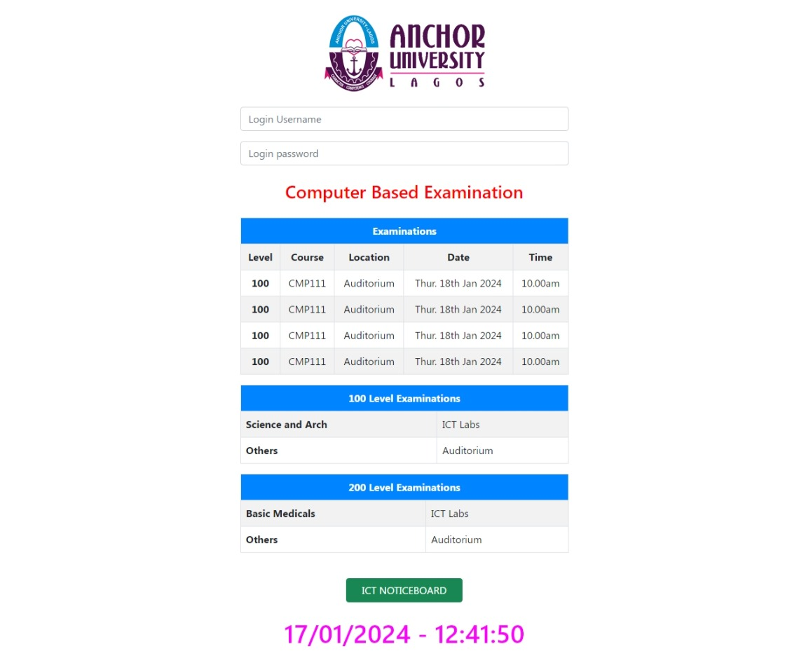

# EDP 411 Exam Web Application Documentation

## Description

This documentation provides an overview of the HTML code for the EDP 411 Exam web application. The application is designed to display information about computer-based examinations at a fictional institution. It uses Bootstrap for styling and responsiveness.

## HTML Structure
- The HTML code starts with the usual `<!DOCTYPE html>` declaration to define the document type.
- The document is written in English (`<html lang="en">`) and consists of a `<head>` and `<body>` section.

## Meta Tags
- Meta tags in the `<head>` section define the character set and viewport settings for the page.

## Title
- The title of the web page is set to "ASSIGNMENT ONE" using the `<title>` tag.

## Styling
- The page includes a `<style>` section to define the CSS styling for the content.
- Various CSS rules are provided for elements such as `<main>`, ``, `<h1>`, `<h2>`, `<h3>`, `
`, `<table>`, `<td>`, and `` to control their appearance.

## Content
- The main content of the page is within the `<main>` element.
- It includes an image (``) of the Anchor University logo, a main heading (`<h1>`) for the university's name, and a secondary heading (`<h2>`) for the memo's title.
- The memo details are presented in a table structure. It specifies the sender and recipient details along with the date.
- The main content ends with a memo description (`<h3>`) and a brief paragraph (`
`) providing the name of the sender and their position.

## Table Styling
- The table and its cells are styled with borders and padding, making the content more visually appealing.

## Sample Memo
- This HTML template is set up to create a sample internal memo for Anchor University, Lagos. The memo's subject is "Internet Bandwidth Upgrade."

Please note that this HTML code is a template and can be customized further to meet specific requirements. It serves as a foundation for creating internal memos within the context of Anchor University or similar institutions.
